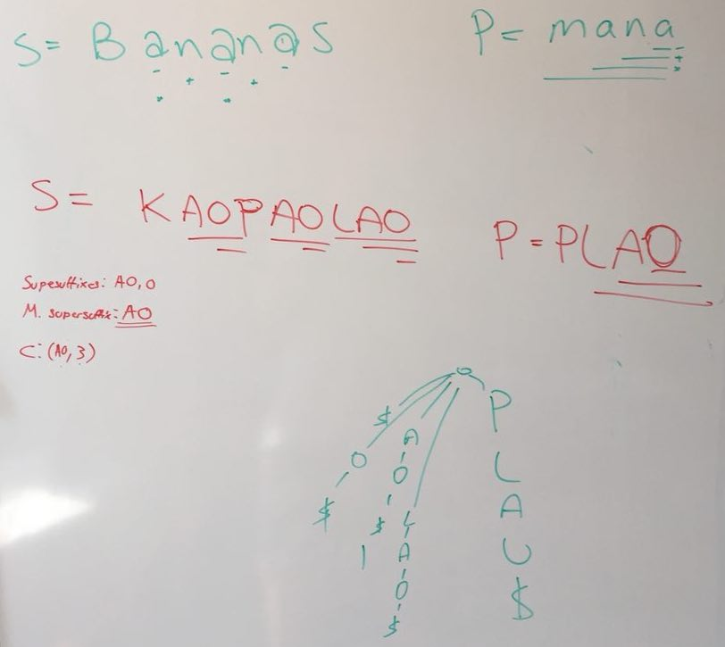

Notes on Algorithms for Massive Data sets and Solutions for Exam Preparation Questions.

## Notes
> coming soon

## Solutions

### Question 1 The Subsequence Problemi
Data-structure for some string $T$ which supports query `subsequence(P)` to test if some string $P$ is a subsequence of $T$.
#### Solution for 1.2

##### Data-structure
A data-structure which supports the `Subsequence(P)` query stores pointers from each letter in $T$ to the next occurrence in $T$ of every letter in the alphabet.

Let $A$ be an array of length $n + 1$. $A$ contains hash-tables hashed over alphabet, $\sigma$. Each key-value pair $(k,v)$ in the hash-table contains some letter $k$ as key and it's next occurrence as value $v$.

* The hash-table $A_0$ contains the first occurrence of every letter in the alphabet.

* The hash-table $A_1$ contains the index of second occurrence for the letter at $T_0$ along with the first occurrence of the other letters.

* The hash-table $A_2$ contains the index of second occurrence for the letters $T_1$ and $T_2$ assuming they are different letters - otherwise $A_2$ will contain the third index of the letter at $T_1$ - along with the first occurrence of the other letters and so on...

Example: If $T$ is `B C A D F B`, $¥$ represents the hashtable $A_0$ and represents a **Ø** null pointer, the data-structure would look like:
```
 |0 1 2 3 4 5
 |¥ B C A D B
A|3 3 3 Ø Ø Ø
B|1 5 5 5 5 Ø
C|2 2 Ø Ø Ø Ø
D|4 4 4 4 Ø Ø
```

The alphabet $\sigma$ is built from the letters in $T$ and is static. Therefore, perfect hashing (FKS) can be used.

##### Running the query
To perform the `Subsequence(P)` query with the string $P$, we lookup the $A$-index of the first occurrence $P_0$ in $T$ using $A_0$.

In the example we could query `Subsequence("BAB")` to test if `BAB` is a subsequence:
* look-up `B` in column 0 which returns index 1
* look-up `A` in column 1 which returns index 3
* look-up `B` in column 3 which returns index 5

As long as we don't pass a null-pointer, the string is subsequence. The hash-lookups take constant time and we have to perform at most $|P|$ of them the runtime is $O(|P|)$.

The space consumption is $O(|P|\cdot|T|)$

### Question 2 The Highest α-Free Ancestor Problem

Let $T$ be a rooted tree with $n$ nodes. Each leaf in $T$ is assigned a label from a set of colors $C$. Given a node $v ∈ T$, the subtree rooted at $v$, denoted $T(v)$, is the tree consisting of $v$ and all descendants of $v$. A subtree $T(v)$ is $α$-free if it does not contain a leaf with label $α$. We are interested in efficient data structures for $T$ that support the following query. Let $l$ be a leaf in $T$ and $α$ a color in $C$.

$HFA(l, α)$: return the highest ancestor $a$ of $l$ such that $T(a)$ is $α$-free.

Give a linear-space data structure for $T$ that supports fast $HFA$ queries. Ignore the preprocessing time.

#### Solution in $O(\log(n))$ time

> ** This following section needs to be re-written!**

No additional changes are made to the original tree. To perform $HFA(\alpha,l)$:

* Start at leaf $l$
* Examine all siblings
  * If any siblings have color $\alpha$ return leaf node $l$
  * Otherwise continue to parents
* all children are \alpha-free continue to the grandparents
* visit the grandparents

 otherwise return the leaf. Continue recursively checking greater-grandparents and all greater-grandchildren until the the subtree at some grandparent is no longer \alpha-free.

Ideas for alternative solution: Find most closely related alpha node and do LCA. Return LCA nodes child on $l$'s side.


### Question 3
### Question 4 Maximal Supersuffix

Current solution takes factorial sum or $O(n^2)$ time:


### Question 5
### Question 6

### Question 7 - String Reversal

Let S be a string of length $N$ stored in $O(N/B)$ blocks.

We want to compute the reverse string $S^R$ of $S$.


#### Algorithm to reverse S in the I/O model.

$B$ is I/O block size and $n$ is Length of string $S$

* Divide $S$ into substrings - such that any two substrings can be loaded in one I/O.
* Read the first and last substrings into memory and reverse each substring.
* Write the reversed substrings each to the others original position.
* Working inwards, repeat the process for each pair of substrings until S has been reversed.

The whole process takes $O(n/B)$ I/Os.

#### Algorithm to reverse S in the cache oblivious model.

* Half the string into substrings recursively until any two substrings fit into **memory**.
* Read the first and last substrings into memory and reverse each substring.
* Write the reversed substrings each to the others original position.
* Working inwards, repeat the process for each pair of substrings until S has been reversed.

The algorithms runs in $O(n/M)$ I/Os
