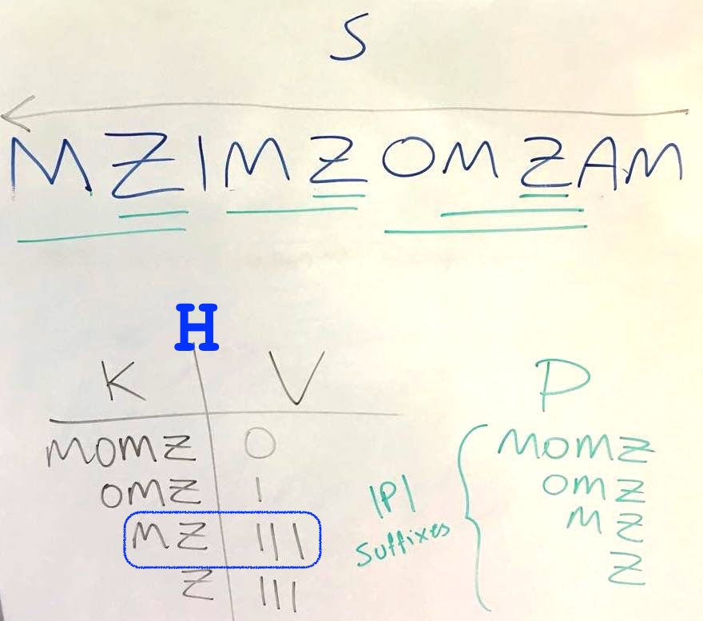

* [Home](README.md)

### Question 4 Maximal Super-suffix

* The number of occurrences in **S**, of each suffix in **P** is stored in a hash-table **H**. For each key-value pair the suffix string is a key and the number of occurrences is a value.
* All occurrences are initialized to zero.
* To count number of occurrences of each suffix, walk left over **S** from the right. Upon passing a suffix, increment it's occurrence in **H**.
* Once **S** has been iterated, iterate over **H** to find the suffix(es) the longest suffix that occurs at least as many times as any other suffix.

In the illustration above, the suffix *'MZ'* would be returned.

#### Performance
The algorithm iterates over **S** which takes **O(|S|)** time. Constructing the suffixes, hash-table and thereafter iterating over **H** takes **O(2·|P|)**. Thus the entire algorithm runs with **O(|S|+|P|)** time complexity.
