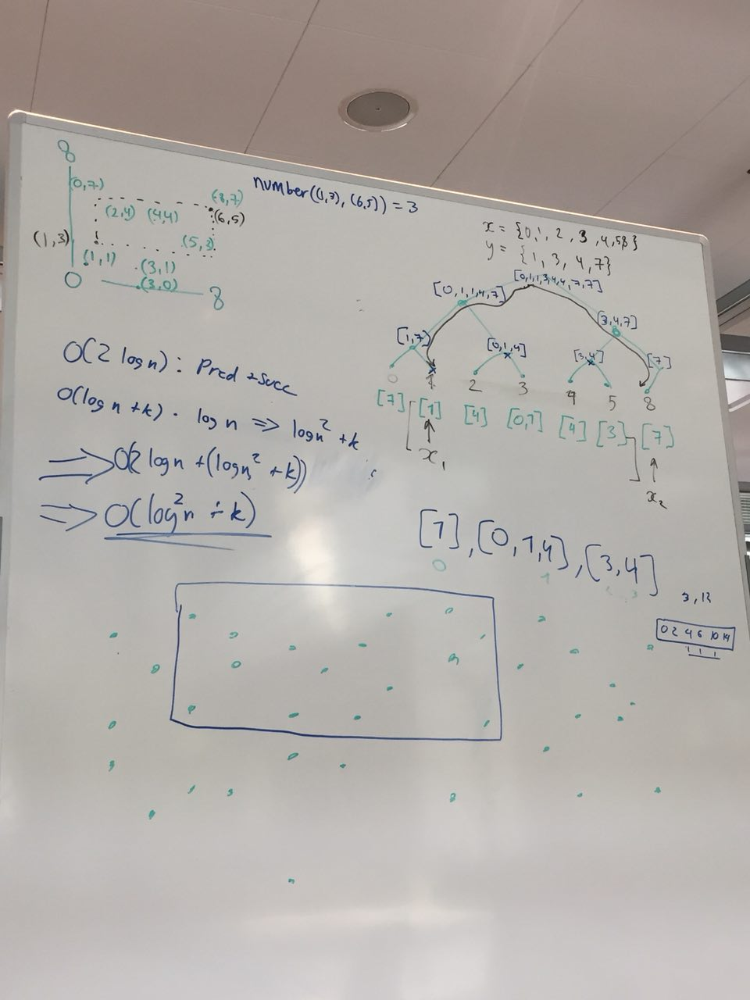

* [Home](README.md)

### Question 6 - 2D Range Numbering

A data-structure that supports to the query **number(R=((x1,y1),(x2,y2)))** can be constructed by:

* Construct a perfectly balanced binary search tree, **T**, over the the x-range with a node for each unique x-value.
* For each node $i$ in $T$, store a sorted array $A_i$ with the y-values of all points $A_i=\{p_y :p \in P , p_x == i_x \}$ who's x-value corresponds to $i$.

***
Not finished
***

* Traverse each point **p** in **P**. Store the y-value of **p** in a sorted array at the leaf node corresponding to **p**'s x-value.
* The values at each **p**
* Each parent node in **T**, stores a sorted array containing the all of the y-values contained in the child nodes' y-value arrays.

